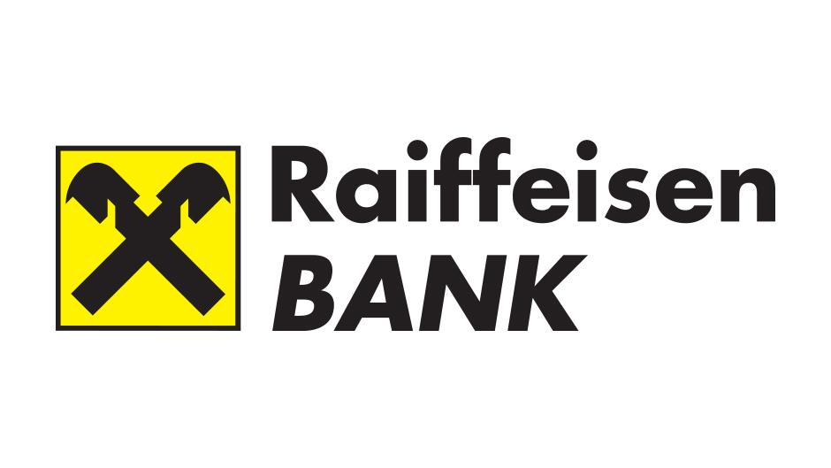

**Bankarski paketi za mlade**
   

<table>
  <tr>
   <td><strong>ZABA</strong>
   </td>
  </tr>
  <tr>
   <td>Mogućnost korištenja neograničenog broja opunomoćenika po svakom računu u paketu
   </td>
  </tr>
  <tr>
   <td>Mastercard Student kreditna kartica za redovite i izvanredne studente 
   </td>
  </tr>
  <tr>
   <td>Prešutno prekoračenje do 10.000 kn po kunskom tekućem računu na temelju redovitog prihoda
   </td>
  </tr>
  <tr>
   <td>Obročno plaćanje Maestro karticom
   </td>
  </tr>
  <tr>
   <td><em>On-line</em> bankarstvo (m-zaba i e-zaba)
   </td>
  </tr>
  <tr>
   <td>Servis centar: pomoć na cesti i putno osiguranje u inozemstvu
   </td>
  </tr>
  <tr>
   <td>
   </td>
  </tr>
  <tr>
   <td>Trošak: 7 kn mjesečno
   </td>
  </tr>
  <tr>
   <td>
   </td>
  </tr>
   </table>
  
   
   <table>

<tr>
   <td>Row 1 Column 1</td><td>Row 1 Column 2</td>
   <td><strong>PBZ</strong>
   </td>
  </tr>
  <tr>
   <td>PBZ tekući račun u kunama i Visa Inspire debitna kartica
   </td>
  </tr>
  <tr>
   <td>PBZ žiro račun u kunama i Visa Electron debitnu karticu
   </td>
  </tr>
  <tr>
   <td>PBZ tekući račun u stranoj valuti i Visa Electron debitnu karticu
   </td>
  </tr>
  <tr>
   <td>Visa Student kartica za studente
   </td>
  </tr>
  <tr>
   <td>PBZ digitalno bankarstvo
   </td>
  </tr>
  <tr>
   <td>Virtualna Visa Inspire debitna kartica
   </td>
  </tr>
  <tr>
   <td>
   </td>
  </tr>
  <tr>
   <td>Trošak: 3,49 kuna do 4,98 kuna mjesečno, ovisno o paketu
   </td>
  </tr>
  <tr>
   <td>
   </td>
  </tr>
   </table> 
   
   <table>
   
  <tr>
   <td><strong>Raiffeissen Bank</strong>
   </td>
  </tr>
  <tr>
   <td>Kreditna kartica s 3.000,00 kuna limita (Mastercard ili Visa Classic kreditna kartica),
   </td>
  </tr>
  <tr>
   <td>Tekući račun s beskontaktnom Mastercard debitnom karticom
   </td>
  </tr>
  <tr>
   <td>Žiro račun  (za primanje stipendije, honorara, uplata od studentskih poslova)
   </td>
  </tr>
  <tr>
   <td>On-line bankarstvo (RBA internetsko i  mobilno bankarstvo)
   </td>
  </tr>
  <tr>
   <td>E-Broker (samostalno trgovanje na Zagrebačkoj burzi)
   </td>
  </tr>
  <tr>
   <td>50% popusta na nacionalne kreditne transfere u kunama s tekućeg računa
   </td>
  </tr>
  <tr>
   <td>
   </td>
  </tr>
  <tr>
   <td>Trošak: 0 kn
   </td>
  </tr>
  <tr>
   <td>
   </td>
  </tr>
  <tr>
   <td>
   </td>
  </tr>
   </table>
   
   <table>

  <tr>
   <td><strong>OTP banka</strong>
   </td>
  </tr>
  <tr>
   <td>Studentski tekući račun (uz Visa Electron ili MasterCard contactless debitnu karticu, po tvom izboru)
   </td>
  </tr>
  <tr>
   <td>Žiro račun
   </td>
  </tr>
  <tr>
   <td>Devizni račun
   </td>
  </tr>
  <tr>
   <td>Internet bankarstvo
   </td>
  </tr>
  <tr>
   <td>Mobilno bankarstvo
   </td>
  </tr>
  <tr>
   <td>Visa web prepaid kartica
   </td>
  </tr>
  <tr>
   <td>
   </td>
  </tr>
  <tr>
   <td>Trošak: 0 kn
   </td>
  </tr>

</table> 
   

<table>

  <tr>
   <td><strong>Erste banka</strong>
   </td>
  </tr>
  <tr>
   <td>Žiro račun
   </td>
  </tr>
  <tr>
   <td>Tekući račun
   </td>
  </tr>
  <tr>
   <td>Mobilno bankarstvo
   </td>
  </tr>
  <tr>
   <td>Beskontaktna kartica
   </td>
  </tr>
  <tr>
   <td>Internet bankarstvo
   </td>
  </tr>
  <tr>
   <td>Dopušten minus na tekućem računu
   </td>
  </tr>
  <tr>
   <td>
   </td>
  </tr>
  <tr>
   <td>Trošak: 0 kn
   </td>
  </tr>
      </table>
      

<table>
  <tr>
   <td><strong>Hrvatska poštanska banka</strong>
   </td>
  </tr>
  <tr>
   <td>Žiro račun
   </td>
  </tr>
  <tr>
   <td>Tekući račun
   </td>
  </tr>
  <tr>
   <td>Mobilno bankarstvo
   </td>
  </tr>
  <tr>
   <td>Internet bankarstvo
   </td>
  </tr>
  <tr>
   <td>Mastercard kartica s odgodom plaćanja (do mjesec dana bez naknade) 
   </td>
  </tr>
  <tr>
   <td>Prekoračenje do 3000 kn
   </td>
  </tr>
  <tr>
   <td>
   </td>
  </tr>
  <tr>
   <td>Trošak: 4-10 kn mjesečno ovisno o paketu 
   </td>
  </tr>
</table>

**Tekući račun** je transakcijski račun koji banka otvara na zahtjev potrošača u svrhu primanja redovitih ili povremenih uplata i obavljanja isplata u granicama raspoloživih sredstava na računu. Pritom se u raspoloživa sredstva uključuje i iznos dopuštenog minusa

**Žiro račun** potrošačima tradicionalno služi za uplatu primanja poput rente ili honorara, kao i za primanja u slučaju da ste član nekog odbora te sukladno tome primate naknadu po sastanku ili proviziju. Koristi se i u idućim slučajevima: ako ostvarujete prihod putem obrta ili drugih samostalnih djelatnosti, ako ste potpisali ugovor o djelu ili autorskom radu te primate honorar i u sličnim situacijama. Za maloljetnike se otvara u svrhu ostvarivanja priljeva na osnovi stipendija, nagrada učenika na natjecanjima te rada učenika i studenata u servisima/udrugama, na sezonskim ili drugim sličnim poslovima.

**VISA prepaid kartica** omogućuje sigurno plaćanje putem interneta. Uz limitiranje visine sredstava na računu i nemogućnost odlaska u minus**.**

**Internet bankarstvo** korištenje svih funkcija našeg računa preko interneta poput prijenosa sredstava, plaćanja računa, provjera stanja računa… 

**Mobilno bankarstvo** korištenje svih funkcija našeg računa preko aplikacije na mobitelu

