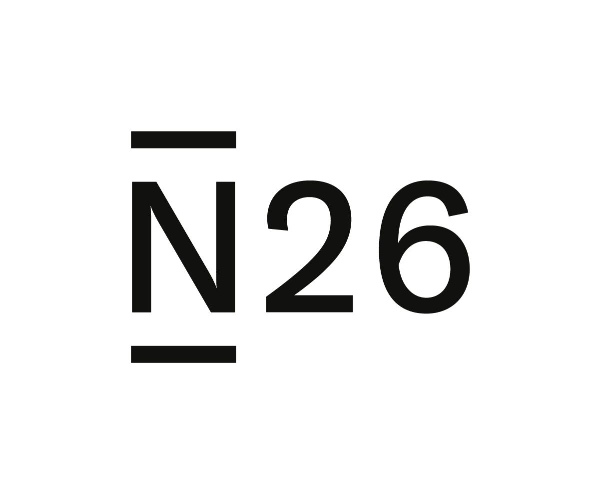

# E- banke

<table>
  <tr>
   <td colspan="2" ><strong>Revolut</strong>
   </td>
  </tr>
  <tr>
   <td>Trošak otvaranja računa
   </td>
   <td>0 kn
   </td>
  </tr>
  <tr>
   <td>Trošak naručivanja kartice
   </td>
   <td>Trošak poštarine 
   </td>
  </tr>
  <tr>
   <td>Trošak podizanja gotovine s bankomata
   </td>
   <td>do 1700 kn nema naknade nakon toga 2% troška 
   </td>
  </tr>
  <tr>
   <td>Trošak transfera novca
   </td>
   <td>0 kn
   </td>
  </tr>
  <tr>
   <td>Vrijeme potrebno za otvoriti račun 
   </td>
   <td>3 min
   </td>
  </tr>
  <tr>
   <td>Mogućnosti
   </td>
   <td> Podizanje gotovine s bankomata, transfer novca, trgovanje dionicama, kupnja kriptovaluta, zamjena valute 
   </td>
  </tr>
</table>

**S revolutom bolje upravljate novcem zbog opcije analiza potrošnje. Slanje novca diljem svijeta bez skrivenih naknada nikad nije bilo jednostavnije. Možete kupovati zlato, kriptovalute i dionice. Revolut ima jak sustav borbe protiv prijevara, jednostavnim klikom registrirajte se i zakoračite u svijet novca.**

<table>
  <tr>
   <td colspan="2" ><strong>N26</strong>
   </td>
  </tr>
  <tr>
   <td>Trošak otvaranja računa
   </td>
   <td>0 kn
   </td>
  </tr>
  <tr>
   <td>Trošak naručivanja kartice
   </td>
   <td>trošak poštarine 
   </td>
  </tr>
  <tr>
   <td>Trošak podizanja gotovine s bnkomata
   </td>
   <td>5 besplatnih podizanja gotovine s bankomata mjesečno u €
   </td>
  </tr>
  <tr>
   <td>Trošak transfera novca
   </td>
   <td>0 kn
   </td>
  </tr>
  <tr>
   <td>Vrijeme potrebno za otvoriti račun 
   </td>
   <td>8 min
   </td>
  </tr>
  <tr>
   <td>Mogućnosti
   </td>
   <td>Podizanje gotovine s bankomata, transfer novca, dodatne opcije osiguranja uključene u premium verziju
   </td>
  </tr>
</table>

**N26 je mobilno bankarstvo koje omogućava prijenos sredstava, štednju i trošenje. Registracija i narudžba kartice je besplatna. N26 ima jednostavan sustav praćenja troškova s kojom  imate bolju organiziranost troškova. Jednostavnim klikom ste bliži do svoje prve E- banke.**

<table>
  <tr>
   <td colspan="2" ><strong>KeksPay</strong>
   </td>
  </tr>
  <tr>
   <td>Trošak otvaranja računa
   </td>
   <td>0 kn
   </td>
  </tr>
  <tr>
   <td>Trošak naručivanja kartice
   </td>
   <td>Nema kartice
   </td>
  </tr>
  <tr>
   <td>Trošak podizanja gotovine s bankomata
   </td>
   <td>Nema tu opciju
   </td>
  </tr>
  <tr>
   <td>Trošak transfera novca
   </td>
   <td>0 kn
   </td>
  </tr>
  <tr>
   <td>Vrijeme potrebno za otvoriti račun 
   </td>
   <td>5 min
   </td>
  </tr>
  <tr>
   <td>Mogućnosti
   </td>
   <td>Jednostavni transfer i primanje novca koje je besplatno
   </td>
  </tr>
</table>

**KeksPay je Hrvatska aplikacija pomoću koje se šalje i prima novac na jednostavan i siguran način bez ikakvih naknada i dugačkih upisivanja šifri. Klikom na: registrirajte se ! olakšajte si  buduće transakcije.**

<table>
  <tr>
   <td colspan="2" ><strong>Monese</strong>
   </td>
  </tr>
  <tr>
   <td>Trošak otvaranja računa
   </td>
   <td>0 kn
   </td>
  </tr>
  <tr>
   <td>Trošak naručivanja kartice
   </td>
   <td>trošak poštarine
   </td>
  </tr>
  <tr>
   <td>Trošak podizanja gotovine s bankoata
   </td>
   <td>200 funti besplatno svakih mjesec dana, a nakon toga 2 % troška
   </td>
  </tr>
  <tr>
   <td>Trošak transfera novca
   </td>
   <td>2 % troška 
   </td>
  </tr>
  <tr>
   <td>Vrijeme potrebno za otvoriti račun 
   </td>
   <td>1 dan
   </td>
  </tr>
  <tr>
   <td>Mogućnosti
   </td>
   <td>Bankovni transferi, plaćanje karticom, štednja, praćenje troškova
   </td>
  </tr>
</table>

**Monese sigurna i jednostavna aplikacija za transfer sredstava i praćenje troškova. Odabirom Monese osigurajte si bolje planiranje troškova.**

<table>
  <tr>
   <td colspan="2" ><strong>Monzo</strong>
   </td>
  </tr>
  <tr>
   <td>Trošak otvaranja računa
   </td>
   <td>0 kn
   </td>
  </tr>
  <tr>
   <td>Trošak naručivanja kartice
   </td>
   <td>trošak poštarine
   </td>
  </tr>
  <tr>
   <td>Trošak podizanja gotovine s bankoata
   </td>
   <td>300 funti besplatno svakih mjesec dana, a nakon toga 3 % troška
   </td>
  </tr>
  <tr>
   <td>Trošak transfera novca
   </td>
   <td>0 kn
   </td>
  </tr>
  <tr>
   <td>Vrijeme potrebno za otvoriti račun 
   </td>
   <td>1 dan
   </td>
  </tr>
  <tr>
   <td>Mogućnosti
   </td>
   <td>Transferi novca, upravljanje štednjom
   </td>
  </tr>
</table>

**Monzo je jednostavna aplikacija za upravljanje štednjom i transfer sredstava. Preporuka je za osobe koje putuju zbog ažurnih i brzih informacija o valutnim i drugih pogodnosti. Odabirom Monzo sva buduća putovanja će postati jednostavnija.**

**E- banke su FinTech ili financijska start-up poduzeća u kojima možete otvoriti bankarski račun s brojnim pogodnostima putem online registracije.**
