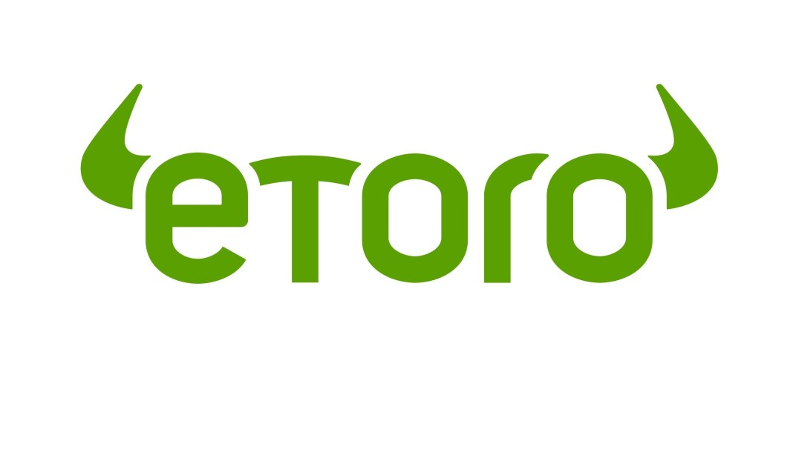

# Online brokeri

**Putem jednostavne registracije zakoračite u svijet investiranja na globalnom tržištu. Trgujte različitim financijskim instrumentima, koristite alate za različite analize, investirajte radi špekulativnih razloga ili dugoročnog ulaganja**

<table>
  <tr>
   <td colspan="2" ><strong>Interactive Brokers</strong>
   </td>
  </tr>
  <tr>
   <td>Minimum depozit
   </td>
   <td>0 $
   </td>
  </tr>
  <tr>
   <td>Vrijeme potrebno za otvaranje računa
   </td>
   <td>1-3 dana
   </td>
  </tr>
  <tr>
   <td>Proizvodi za trgovanje
   </td>
   <td>Dionice, ETF, opcije, fondovi, futures, forex, kriptovalute
   </td>
  </tr>
  <tr>
   <td>Trošak neaktivnosti računa
   </td>
   <td>20 $ mjesečno
   </td>
  </tr>
  <tr>
   <td>Trošak prijenos s brokerskog na tekuću račun
   </td>
   <td>0 $
   </td>
  </tr>
  <tr>
   <td>Potrebni dokumenti
   </td>
   <td>Dokaz prebivališta i osobni dokument
   </td>
  </tr>
</table>

**Preporuka  za investitore koje privlači nizak trošak i profesionalno okruženje investiranja s velikim izborom instrumenata**

<table>
  <tr>
   <td colspan="2" ><strong>Plus500</strong>
   </td>
  </tr>
  <tr>
   <td>Minimum depozit
   </td>
   <td>100$
   </td>
  </tr>
  <tr>
   <td>Vrijeme potrebno za otvaranje računa
   </td>
   <td>1 dan
   </td>
  </tr>
  <tr>
   <td>Proizvodi za trgovanje
   </td>
   <td>CFD
   </td>
  </tr>
  <tr>
   <td>Trošak neaktivnosti računa
   </td>
   <td>10 $ nakon 3 mjeseca neaktivnosti
   </td>
  </tr>
  <tr>
   <td>Trošak prijenos s brokerskog na tekuću račun
   </td>
   <td>0 $
   </td>
  </tr>
  <tr>
   <td>Potrebni dokumenti
   </td>
   <td>Dokaz prebivališta i osobni dokument
   </td>
  </tr>
</table>

**Preporuka za iskusne investitore koji traže platformu za jednostavno korištenje**

<table>
  <tr>
   <td colspan="2" ><strong>eToro</strong>
   </td>
  </tr>
  <tr>
   <td>Minimum depozit
   </td>
   <td>200$
   </td>
  </tr>
  <tr>
   <td>Vrijeme potrebno za otvaranje računa
   </td>
   <td>1 dan
   </td>
  </tr>
  <tr>
   <td>Proizvodi za trgovanje
   </td>
   <td>Dionice, ETF, forex, kriptovalute, CFD
   </td>
  </tr>
  <tr>
   <td>Trošak neaktivnosti računa
   </td>
   <td> primjenjuje se nakon određenog vremena neaktivnosti
   </td>
  </tr>
  <tr>
   <td>Trošak prijenos s brokerskog na tekuću račun
   </td>
   <td>5$
   </td>
  </tr>
  <tr>
   <td>Potrebni dokumenti
   </td>
   <td>Dokaz prebivališta i osobni dokument
   </td>
  </tr>
</table>

**Preporuka se za investitore koje zanima društveno investiranje (kopiranje drugih investitora na tržištu)**

<table>
  <tr>
   <td colspan="2" ><strong>Trade station</strong>
   </td>
  </tr>
  <tr>
   <td>Minimum depozit
   </td>
   <td>500$
   </td>
  </tr>
  <tr>
   <td>Vrijeme potrebno za otvaranje računa
   </td>
   <td>1 dan
   </td>
  </tr>
  <tr>
   <td>Proizvodi za trgovanje
   </td>
   <td>Dionice, ETF, opcije, futures, obeznice i fondovi
   </td>
  </tr>
  <tr>
   <td>Trošak neaktivnosti računa
   </td>
   <td> 50 $ godišnje ako je manje od 2000$ na kraju godine na računu
   </td>
  </tr>
  <tr>
   <td>Trošak prijenos s brokerskog na tekuću račun
   </td>
   <td>35 $
   </td>
  </tr>
  <tr>
   <td>Potrebni dokumenti
   </td>
   <td>Dokaz prebivališta i osobni dokument
   </td>
  </tr>
</table>

**Preporuka za investitore koje zanima Američka burza i dugoročno ulaganje**

<table>
  <tr>
   <td colspan="2" ><strong>OANDA</strong>
   </td>
  </tr>
  <tr>
   <td>Minimum depozit
   </td>
   <td>0$
   </td>
  </tr>
  <tr>
   <td>Vrijeme potrebno za otvaranje računa
   </td>
   <td>1-3 dana
   </td>
  </tr>
  <tr>
   <td>Proizvodi za trgovanje
   </td>
   <td>Forex i CFD
   </td>
  </tr>
  <tr>
   <td>Trošak neaktivnosti računa
   </td>
   <td>10 $ godišnje nakon 2 godine neaktivnosti
   </td>
  </tr>
  <tr>
   <td>Trošak prijenos s brokerskog na tekuću račun
   </td>
   <td>20 $
   </td>
  </tr>
  <tr>
   <td>Potrebni dokumenti
   </td>
   <td>Dokaz prebivališta i osobni dokument
   </td>
  </tr>
</table>

**Preporuka za forex investitore koji žele jednostavno sučelje i napredne alate za analizu**

<table>
  <tr>
   <td colspan="2" ><strong>Trading 212</strong>
   </td>
  </tr>
  <tr>
   <td>Minimum depozit
   </td>
   <td>1$
   </td>
  </tr>
  <tr>
   <td>Vrijeme potrebno za otvaranje računa
   </td>
   <td>1 dan
   </td>
  </tr>
  <tr>
   <td>Proizvodi za trgovanje
   </td>
   <td>Dionice, ETF, forex, kriptovalute, CFD
   </td>
  </tr>
  <tr>
   <td>Trošak neaktivnosti računa
   </td>
   <td>0$
   </td>
  </tr>
  <tr>
   <td>Trošak prijenos s brokerskog na tekuću račun
   </td>
   <td>0$
   </td>
  </tr>
  <tr>
   <td>Potrebni dokumenti
   </td>
   <td>Dokaz prebivališta i osobni dokument
   </td>
  </tr>
</table>

**Preporuka za investitore koji traže niske troškove i velik izbor dionica**

<table>
  <tr>
   <td colspan="2" ><strong>Papperstone</strong>
   </td>
  </tr>
  <tr>
   <td>Minimum depozit
   </td>
   <td>0 $
   </td>
  </tr>
  <tr>
   <td>Vrijeme potrebno za otvaranje računa
   </td>
   <td>1 dan
   </td>
  </tr>
  <tr>
   <td>Proizvodi za trgovanje
   </td>
   <td>Forex, kriptovalute, CFD
   </td>
  </tr>
  <tr>
   <td>Trošak neaktivnosti računa
   </td>
   <td>0$
   </td>
  </tr>
  <tr>
   <td>Trošak prijenos s brokerskog na tekuću račun
   </td>
   <td>20 $
   </td>
  </tr>
  <tr>
   <td>Potrebni dokumenti
   </td>
   <td>Dokaz prebivališta i osobni dokument
   </td>
  </tr>
</table>

**Preporuka za forex investitore koje zanima Američko tržište**

<table>
  <tr>
   <td colspan="2" ><strong>Revolut (trading)</strong>
   </td>
  </tr>
  <tr>
   <td>Minimum depozit
   </td>
   <td>0$
   </td>
  </tr>
  <tr>
   <td>Vrijeme potrebno za otvaranje računa
   </td>
   <td>1 dan
   </td>
  </tr>
  <tr>
   <td>Proizvodi za trgovanje
   </td>
   <td>Dionice i kriptovalute
   </td>
  </tr>
  <tr>
   <td>Trošak neaktivnosti računa
   </td>
   <td>0$
   </td>
  </tr>
  <tr>
   <td>Trošak prijenos s brokerskog na tekuću račun
   </td>
   <td>0$
   </td>
  </tr>
  <tr>
   <td>Potrebni dokumenti
   </td>
   <td>Dokaz prebivališta i osobni dokument
   </td>
  </tr>
</table>

**Preporuka za investitora početnika zbog jednostavnog sučelja i niskih troškova**

